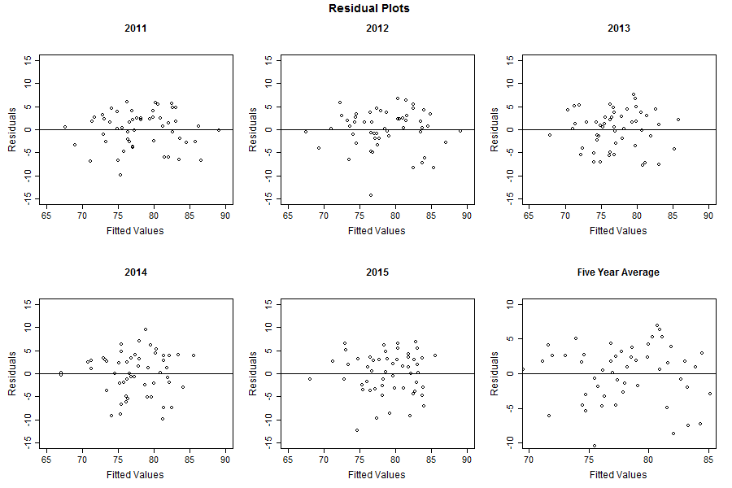

# Methods and Results

## Yearly Insured Rates

```{r, include=F, eval=FALSE}

library(RSocrata)
url_base <- "https://chronicdata.cdc.gov/resource/fn2i-3j6c.json?"

Insured.Rates.11 <- read.socrata(paste0(url_base,
                                        "question=Do you have any kind of health care coverage?",
                                        "&year=2011",
                                        "&break_out=Overall",
                                        "&response=Yes")
                                 )

Insured.Rates.11 <- Insured.Rates.11[, c("locationabbr", "confidence_limit_low", "data_value", "confidence_limit_high", "sample_size")]
colnames(Insured.Rates.11) <- c("State", "CI.LB", "Estimate", "CI.UB", "Sample.Size")
write.csv(Insured.Rates.11, "2011 Insured Rates.csv")

Insured.Rates.12 <- read.socrata(paste0(url_base,
                                        "question=Do you have any kind of health care coverage?",
                                        "&year=2012",
                                        "&break_out=Overall",
                                        "&response=Yes")
)

Insured.Rates.12 <- Insured.Rates.12[, c("locationabbr", "confidence_limit_low", "data_value", "confidence_limit_high", "sample_size")]
colnames(Insured.Rates.12) <- c("State", "CI.LB", "Estimate", "CI.UB", "Sample.Size")
write.csv(Insured.Rates.12, "2012 Insured Rates.csv")

Insured.Rates.13 <- read.socrata(paste0(url_base,
                                        "question=Do you have any kind of health care coverage?",
                                        "&year=2013",
                                        "&break_out=Overall",
                                        "&response=Yes")
)

Insured.Rates.13 <- Insured.Rates.13[, c("locationabbr", "confidence_limit_low", "data_value", "confidence_limit_high", "sample_size")]
colnames(Insured.Rates.13) <- c("State", "CI.LB", "Estimate", "CI.UB", "Sample.Size")
write.csv(Insured.Rates.13, "2013 Insured Rates.csv")

Insured.Rates.14 <- read.socrata(paste0(url_base,
                                        "question=Do you have any kind of health care coverage?",
                                        "&year=2014",
                                        "&break_out=Overall",
                                        "&response=Yes")
)

Insured.Rates.14 <- Insured.Rates.14[, c("locationabbr", "confidence_limit_low", "data_value", "confidence_limit_high", "sample_size")]
colnames(Insured.Rates.14) <- c("State", "CI.LB", "Estimate", "CI.UB", "Sample.Size")
write.csv(Insured.Rates.14, "2014 Insured Rates.csv")

Insured.Rates.15 <- read.socrata(paste0(url_base,
                                        "question=Do you have any kind of health care coverage?",
                                        "&year=2015",
                                        "&break_out=Overall",
                                        "&response=Yes")
)

Insured.Rates.15 <- Insured.Rates.15[, c("locationabbr", "confidence_limit_low", "data_value", "confidence_limit_high", "sample_size")]
colnames(Insured.Rates.15) <- c("State", "CI.LB", "Estimate", "CI.UB", "Sample.Size")
write.csv(Insured.Rates.15, "2015 Insured Rates.csv")

```

```{r, include=F}

Insured.Rates.11 <- read.csv("2011 Insured Rates.csv")[,2:6]
Insured.Rates.12 <- read.csv("2012 Insured Rates.csv")[,2:6]
Insured.Rates.13 <- read.csv("2013 Insured Rates.csv")[,2:6]
Insured.Rates.14 <- read.csv("2014 Insured Rates.csv")[,2:6]
Insured.Rates.15 <- read.csv("2015 Insured Rates.csv")[,2:6]

National.IR_calc <- function(x, alpha = 0.05){
  
  z <- qnorm(alpha/2, lower.tail = F)
  n <- sum(x[1:53,5])
  
  IR <- sum(x[1:53,3]*x[1:53,5])/ (n)
  SE <- sqrt(sum(x[1:53,5]*x[1:53,3]*(100 - x[1:53,3]))) / (n)
  LB <- IR - z*SE
  UB <- IR + z*SE
  
  out <- c(round(LB, digits = 4), round(IR, digits = 4), round(UB, digits = 4), round(SE, digits = 4))
  
  out
}

MedicaidExp.IR_calc <- function(x, alpha = 0.05){
  df <- x[1:53,]
  df <- df[order(df$State),]
  df <- df[df$State != "AK" 
          & df$State != "AR" 
          & df$State != "AZ" 
          & df$State != "IA" 
          & df$State != "IN" 
          & df$State != "MI"
          & df$State != "NH" 
          & df$State != "PA"
          & df$State != "WI",]
  
  mdf <- df[df$State != "AL" 
          & df$State != "FL" 
          & df$State != "GA" 
          & df$State != "ID" 
          & df$State != "KS" 
          & df$State != "LA"
          & df$State != "ME" 
          & df$State != "MS"
          & df$State != "MT"
          & df$State != "MO" 
          & df$State != "NE" 
          & df$State != "NC" 
          & df$State != "OK" 
          & df$State != "SC"
          & df$State != "SD" 
          & df$State != "TN"
          & df$State != "TX"
          & df$State != "UT" 
          & df$State != "VA"
          & df$State != "WY",]
  
  nmdf <- df[df$State == "AL" 
          | df$State == "FL" 
          | df$State == "GA" 
          | df$State == "ID" 
          | df$State == "KS" 
          | df$State == "LA"
          | df$State == "ME" 
          | df$State == "MS"
          | df$State == "MT"
          | df$State == "MO" 
          | df$State == "NE" 
          | df$State == "NC" 
          | df$State == "OK" 
          | df$State == "SC"
          | df$State == "SD" 
          | df$State == "TN"
          | df$State == "TX"
          | df$State == "UT" 
          | df$State == "VA"
          | df$State == "WY",]
  
  z <- qnorm(alpha/2, lower.tail = F)
  
  n <- sum(mdf[,5])
  IR <- sum(mdf[,3]*mdf[,5])/ (n)
  SE <- sqrt(sum(mdf[,5]*mdf[,3]*(100 - mdf[,3]))) / (n)
  LB <- IR - z*SE
  UB <- IR + z*SE
  
  out <- c(round(LB, digits = 4), round(IR, digits = 4), round(UB, digits = 4), round(SE, digits = 4))
  
  n <- sum(nmdf[,5])
  IR <- sum(nmdf[,3]*nmdf[,5])/ (n)
  SE <- sqrt(sum(nmdf[,5]*nmdf[,3]*(100 - nmdf[,3]))) / (n)
  LB <- IR - z*SE
  UB <- IR + z*SE
  
  out <- c(out, round(LB, digits = 4), round(IR, digits = 4), round(UB, digits = 4), round(SE, digits = 4))
  
  out

}

Yearly.IR <- matrix(c(National.IR_calc(Insured.Rates.11), MedicaidExp.IR_calc(Insured.Rates.11),
                      National.IR_calc(Insured.Rates.12), MedicaidExp.IR_calc(Insured.Rates.12),
                      National.IR_calc(Insured.Rates.13), MedicaidExp.IR_calc(Insured.Rates.13),
                      National.IR_calc(Insured.Rates.14), MedicaidExp.IR_calc(Insured.Rates.14),
                      National.IR_calc(Insured.Rates.15), MedicaidExp.IR_calc(Insured.Rates.15)),
                     nrow = 15, ncol = 4, byrow = T,
                     dimnames = list(c("2011", "2001", "2011", 
                                       "2012", "2012", "2012", 
                                       "2013", "2013", "2013", 
                                       "2014", "2014", "2014", 
                                       "2015", "2015", "2015"), 
                                     c("Lower Bound", "Estimate", "Upper Bound", "Standard Error"))
                     )

```

  Tables 1, 2 and 3 report the estimated yearly insured rates of adults for the nation as a whole, states that adopted medicaid expansion on January 1st 2014, and those states that had not adopted the expansion as of the end of 2015. These insured rates were estimated from the 2011 to 2015 BRFSS which is restricted to adults. This restriction may account for the estimated insured rates reported here being slightly less than those reported by the US Census Bureau. The percentage of insured adults does indeed rise from 2011 to 2015, even in states that did not adopt the Medicaid expansion. Moreover, there appears to be a particularly sharp increase from 2013 to 2015, which corresponds temporally with the initiation of most of the ACA reforms. However, states that did not adopt the Medicaid expansion had lower insured rates than those that did. Figures 1 and 2 show this graphically.

***

```{r, echo=F, results="asis"}

library(pander)

x <- Yearly.IR[c(1,4,7,10,13),]

pandoc.table(x, caption = "**Table 1:** Estimated yearly adult insured rates (in percentages) for the nation as a whole. The table gives 95% confidence intervals for the percentage of insured adults as estimated from the 2011 to 2015 BRFSS surveys.", split.table = Inf)

```

<br>

```{r, echo=F, results="asis"}

x <- Yearly.IR[c(2,5,8,11,14),]

pandoc.table(x, caption = "**Table 2:** Estimated yearly adult insured rates (in percentages) for states that adopted the Medicaid expansion on January 1st 2014. The table gives 95% confidence intervals for the percentage of insured adults in states that adopted the Medicaid expansion, as estimated from the 2011 to 2015 BRFSS surveys.", split.table = Inf)

```

<br>

```{r, echo=F, results="asis"}

x <- Yearly.IR[c(3,6,9,12,15),]

pandoc.table(x, caption = "**Table 3:** Estimated yearly adult insured rates (in percentages) for states that had not adopted the Medicaid expansion as of the end of 2015. The table gives 95% confidence intervals for the percentage of insured adults in states that did not adopt the Medicaid expansion, as estimated from the 2011 to 2015 BRFSS surveys.", split.table = Inf)

rm(x)

```

<br>

```{r, include=F}

png("plots/Nation_IR.png",
     height = 400, width = 480)
 
barcenters <- barplot(Yearly.IR[c(1,4,7,10,13),2], 
                      ylim = c( 80  , 92 ),
                      main = "Estimated Insured Rates among Adults: National Level", 
                      ylab = "Percentage",
                      xpd = FALSE, cex.names = .9, cex.main = 1 )

abline(h=80)

segments(barcenters, Yearly.IR[c(1,4,7,10,13),1], barcenters,Yearly.IR[c(1,4,7,10,13),3], 
         lwd = 1.5)

arrows(barcenters, Yearly.IR[c(1,4,7,10,13),1], barcenters, Yearly.IR[c(1,4,7,10,13),3], 
       lwd = 1.5, angle = 90, code = 3, length = 0.05)

dev.off()


```


<br>

```{r, include=F}

png("plots/Medicaid_IR.png",
     height = 400, width = 800)

par(mfrow=c(1,2))
barplot(Yearly.IR[c(2,5,8,11,14),2], 
        ylim = c( 80,92 ),
        main = NA,
        sub = "Medicaid Expansion", 
        ylab = "Percentage",
        xpd = FALSE, 
        cex.names = .9, cex.main = 1
        )
abline(h=80)

segments(barcenters, Yearly.IR[c(2,5,8,11,14),1], barcenters, Yearly.IR[c(2,5,8,11,14),3], 
         lwd = 1.5)

arrows(barcenters, Yearly.IR[c(2,5,8,11,14),1], barcenters, Yearly.IR[c(2,5,8,11,14),3], 
       lwd = 1.5, angle = 90, code = 3, length = 0.05)

barplot(Yearly.IR[c(3,6,9,12,15),2], 
        ylim = c(80, 92),
        main = NA,
        sub = "No Medicaid Expansion", 
        ylab = NA,
        xpd = FALSE, 
        cex.names = .9, cex.main = 1
        )
abline(h=80)

segments(barcenters, Yearly.IR[c(3,6,9,12,15),1], barcenters, Yearly.IR[c(3,6,9,12,15),3], 
         lwd = 1.5)

arrows(barcenters, Yearly.IR[c(3,6,9,12,15),1], barcenters, Yearly.IR[c(3,6,9,12,15),3], 
       lwd = 1.5, angle = 90, code = 3, length = 0.05)

mtext('Estimated Insured Rates among Adults: States with Medicaid Expansion and States without', outer = TRUE, font = 2, padj = 2)

dev.off()

```

![**Figure 2:** The plots above show the estimated percentage of adults with insurance in states that adopted the Medicaid expansion at the beginning of 2014 and those that had not adopted the expansion as of the end of 2015. The line segments at the top of each bar indicate the 95% confidence for the percentage of insured adults for that year. It is clear that in both states with and without the Medicaid expansion, insured rates have increased from 2011 to 2015 and there was a sharp boost in insured rates from 2013 to 2014 that corresponds with the initiation of most of the ACA reforms. Also, it is clear that while insured rates increaed for both Medicaid expansion states and non-Medicaid expansion states, overall the percentage of insured adults in states without the expansion is much lower..](plots/Medicaid_IR.png)

<br>

***

<br>
<br>

## Relationship between Insured Rate and Primary Care Access: Poisson Regression

### Cleaning Data

  Firstly we need to clean our data sets by removing all missing values. We will check how many observations we end up eliminating to be sure that this removal will not impact our analysis significantly. Table 4 reports the number of observations before and after cleaning for each year as well as the percentage removed. Since only a small fraction (at most 0.79%) were removed for any given year we accept that the effect of these removals will be negligible. We will also split each data set in half so we will have one half for fitting our model and one half for testing.

```{r, include=F, eval=F}

library(Hmisc)
BRFSS2015full <- sasxport.get("LLCP2015.XPT")
BRFSS2014full <- sasxport.get("LLCP2014.XPT")
BRFSS2013full <- sasxport.get("LLCP2013.XPT")
BRFSS2012full <- sasxport.get("LLCP2012.XPT")
BRFSS2011full <- sasxport.get("LLCP2011.XPT")

t15.data <- BRFSS2015full[,c("hlthpln1", "persdoc2", "x.llcpwt", "x.state")]
t14.data <- BRFSS2014full[,c("hlthpln1", "persdoc2", "x.llcpwt", "x.state")]
t13.data <- BRFSS2013full[,c("hlthpln1", "persdoc2", "x.llcpwt", "x.state")]
t12.data <- BRFSS2012full[,c("hlthpln1", "persdoc2", "x.llcpwt", "x.state")]
t11.data <- BRFSS2011full[,c("hlthpln1", "persdoc2", "x.llcpwt", "x.state")]

rm(BRFSS2015full, BRFSS2014full, BRFSS2013full, BRFSS2012full, BRFSS2011full)


## count observations before cleaning
n <- c(nrow(t11.data),
       nrow(t12.data),
       nrow(t13.data),
       nrow(t14.data),
       nrow(t15.data))


## Remove missing values, refusals to respond, and thuse who were unsure
cleaner <- function(x){
  
      df <- x
      
      for(i in 1:4){
            df <- df[!is.na(df[,i]),] 
      }
      
      for(i in 1:2){
           df <- df[df[,i] != 7 & df[,i] != 9,] 
      }

      
      df
}

t11.data <- cleaner(t11.data)
t12.data <- cleaner(t12.data)
t13.data <- cleaner(t13.data)
t14.data <- cleaner(t14.data)
t15.data <- cleaner(t15.data)

## Count observations after cleaning
nc <- c(nrow(t11.data),
        nrow(t12.data),
        nrow(t13.data),
        nrow(t14.data),
        nrow(t15.data))


removed.vals <- matrix(c(n, nc, (n-nc), ((n-nc)/n)*100), nrow = 5, ncol = 4,
                       dimnames = list(c("2011", "2012", "2013", "2014", "2015"),
                                       c("Total Before Cleaning", "Total After Cleaning", "Number Removed", "Percentage Removed"))
                       )
write.csv(removed.vals, "removedvaluestable.csv")

## splitting data sets

t11.data[,"index"] <- 1:nrow(t11.data)
sf <-            sample(nrow(t11.data), size = ceiling(nrow(t11.data)/2))
st <-         setdiff(1:nrow(t11.data), sf)
t11.data.fit <-              t11.data[sf, ]
t11.data.test <-             t11.data[st, ]

t12.data[,"index"] <- 1:nrow(t12.data)
sf <-            sample(nrow(t12.data), size = ceiling(nrow(t12.data)/2))
st <-         setdiff(1:nrow(t12.data), sf)
t12.data.fit <-              t12.data[sf, ]
t12.data.test <-             t12.data[st, ]

t13.data[,"index"] <- 1:nrow(t13.data)
sf <-            sample(nrow(t13.data), size = ceiling(nrow(t12.data)/2))
st <-         setdiff(1:nrow(t13.data), sf)
t13.data.fit <-              t13.data[sf, ]
t13.data.test <-             t13.data[st, ]

t14.data[,"index"] <- 1:nrow(t14.data)
sf <-            sample(nrow(t14.data), size = ceiling(nrow(t12.data)/2))
st <-         setdiff(1:nrow(t14.data), sf)
t14.data.fit <-              t14.data[sf, ]
t14.data.test <-             t14.data[st, ]

t15.data[,"index"] <- 1:nrow(t15.data)
sf <-            sample(nrow(t15.data), size = ceiling(nrow(t12.data)/2))
st <-         setdiff(1:nrow(t15.data), sf)
t15.data.fit <-              t15.data[sf, ]
t15.data.test <-             t15.data[st, ]


write.csv(t11.data[,1:4], 'Cleaned 2011 BRFSS Data.csv')
write.csv(t12.data[,1:4], 'Cleaned 2012 BRFSS Data.csv')
write.csv(t13.data[,1:4], 'Cleaned 2013 BRFSS Data.csv')
write.csv(t14.data[,1:4], 'Cleaned 2014 BRFSS Data.csv')
write.csv(t15.data[,1:4], 'Cleaned 2015 BRFSS Data.csv')

write.csv(t11.data.fit[,1:4], 'Cleaned 2011 BRFSS Data for Fitting.csv')
write.csv(t12.data.fit[,1:4], 'Cleaned 2012 BRFSS Data for Fitting.csv')
write.csv(t13.data.fit[,1:4], 'Cleaned 2013 BRFSS Data for Fitting.csv')
write.csv(t14.data.fit[,1:4], 'Cleaned 2014 BRFSS Data for Fitting.csv')
write.csv(t15.data.fit[,1:4], 'Cleaned 2015 BRFSS Data for Fitting.csv')

write.csv(t11.data.test[,1:4], 'Cleaned 2011 BRFSS Data for Testing.csv')
write.csv(t12.data.test[,1:4], 'Cleaned 2012 BRFSS Data for Testing.csv')
write.csv(t13.data.test[,1:4], 'Cleaned 2013 BRFSS Data for Testing.csv')
write.csv(t14.data.test[,1:4], 'Cleaned 2014 BRFSS Data for Testing.csv')
write.csv(t15.data.test[,1:4], 'Cleaned 2015 BRFSS Data for Testing.csv')

t11.data <- data.frame(read.csv("Cleaned 2011 BRFSS Data for Fitting.csv"))[,2:5]
t12.data <- data.frame(read.csv("Cleaned 2012 BRFSS Data for Fitting.csv"))[,2:5]
t13.data <- data.frame(read.csv("Cleaned 2013 BRFSS Data for Fitting.csv"))[,2:5]
t14.data <- data.frame(read.csv("Cleaned 2014 BRFSS Data for Fitting.csv"))[,2:5]
t15.data <- data.frame(read.csv("Cleaned 2015 BRFSS Data for Fitting.csv"))[,2:5]

```

***

```{r, include=F}

removed.vals <- read.csv("removedvaluestable.csv")

```

```{r, echo=F, results="asis"}

colnames(removed.vals) <- c("Year", "Total Before Cleaning", "Total After Cleaning", "Number Removed", "Percentage Removed")

pandoc.table(removed.vals,
             caption = "**Table 4:** Number of missing values removed from data sets.",
             split.table = Inf)

```

<br>

***

<br>
<br>
### Computed Weighted Counts

  We are interested in how the percentage of individuals with a personal doctor in a state is related to the percentage of people with insurance. Viewing percentage of people with a personal doctor as a rate (a per capita rate) we can use Poisson regression to regress this rate on the pecentage of individuals with insurance. We will use each individual state/territory included in the BRFSS as an observation. In order to do this we need to get the counts of individuals with a personal doctor and the counts of individuals with insurance for each state/territory. When doing this though we need to make use of the recomended weights in the BRFSS.
  
  For each observation (state/territory) we will have three values:

+ Weighted counts (rounded to nearest integer) of respondents with a personal doctor in that state
+ Weighted counts (rounded to nearest integer) of respondents with insurance in that state
+ Total number of respondents from that state (used as the offset in the regression model)

```{r, include=F, eval=F}

counter <- function(x){
  
  out <- matrix(data = NA, 
                nrow = length(unique(x$x.state)),
                ncol = 4)
  colnames(out) <- c("Personal Doctor Count", "Insurance Count", "Total Respondents", "Medicaid Expansion")
  
  c <- 0
  for(i in unique(x$x.state)){
    
    c <- c + 1
    wsum <- sum(x$x.llcpwt[x$x.state == i])
    n <- length(x$x.llcpwt[x$x.state == i])
    wf <- n/wsum
    
    countpd <- sum(x$x.llcpwt[x$x.state == i & x$persdoc2 == 1]) + sum(x$x.llcpwt[x$x.state == i & x$persdoc2 == 2])
    countpd <- round(countpd*wf, digits = 0)
    
    countin <- sum(x$x.llcpwt[x$x.state == i & x$hlthpln1 == 1])
    countin <- round(countin*wf, digits = 0)
    
    out[c,1] <- countpd
    out[c,2] <- countin
    out[c,3] <- n
    
  }
  
  
  
  rownames(out) <- c(state.abb[1:8],
                     "DC",
                     state.abb[9:50],
                     "GU", "PR")
  
  states <- as.character(row(out, as.factor = T)[,1])
  states <-  setdiff(states, c("AK", "AR", "AZ", 
                               "IA", "IN", "MI", 
                               "NH", "PA", "WI")
                     )
  
  nomed <- c("AL", "FL", "GA", "ID", 
             "KS", "LA", "ME", "MS",
             "MT", "MO", "NE", "NC", 
             "OK", "SC", "SD", "TN",
             "TX", "UT", "VA", "WY")
  
  med <- setdiff(states, nomed)
  
  out[c("AK", "AR", "AZ", 
        "IA", "IN", "MI", 
        "NH", "PA", "WI"), 4] <- 100
  out[nomed, 4] <- 0
  out[med, 4] <- 1
  
  
  out
}

t11.counts <- counter(t11.data)
t12.counts <- counter(t12.data)
t13.counts <- counter(t13.data)
t14.counts <- counter(t14.data)
t15.counts <- counter(t15.data)
AY.counts <- t11.counts + t12.counts + t13.counts + t14.counts + t15.counts
AY.counts[,4] <- AY.counts[,4]/5

write.csv(t11.counts, "2011 counts.csv")
write.csv(t12.counts, "2012 counts.csv")
write.csv(t13.counts, "2013 counts.csv")
write.csv(t14.counts, "2014 counts.csv")
write.csv(t15.counts, "2015 counts.csv")
write.csv(AY.counts, "All Year counts.csv")

```

```{r, include=F}

t11.counts <- read.csv("2011 counts.csv")
rownames(t11.counts) <- t11.counts[,1]
t11.counts <- t11.counts[,2:5]

t12.counts <- read.csv("2012 counts.csv")
rownames(t12.counts) <- t12.counts[,1]
t12.counts <- t12.counts[,2:5]

t13.counts <- read.csv("2013 counts.csv")
rownames(t13.counts) <- t13.counts[,1]
t13.counts <- t13.counts[,2:5]

t14.counts <- read.csv("2014 counts.csv")
rownames(t14.counts) <- t14.counts[,1]
t14.counts <- t14.counts[,2:5]

t15.counts <- read.csv("2015 counts.csv")
rownames(t15.counts) <- t15.counts[,1]
t15.counts <- t15.counts[,2:5]

AY.counts <- read.csv("All Year counts.csv")
rownames(AY.counts) <- AY.counts[,1]
AY.counts <- AY.counts[,2:5]

```

For instance, the observation for the state of Maine for 2011 would look as follows

***

```{r, echo=F, results="asis"}

x <- t11.counts["ME",]
colnames(x) <- c("Personal Doctor Count", "Insurance Count", "Total Respondents", "Medicaid Expansion")

pandoc.table(x[1:3],
             caption = "2011 observation for state of Maine",
             split.table = Inf)

```

***
<br>

```{r, include=F}

## Standardizing counts by total number of respondents

t11.std <- data.frame(t11.counts)
t11.std[,1] <- round(100*t11.std[,1]/t11.std[,3], digits = 5)
t11.std[,2] <- round(100*t11.std[,2]/t11.std[,3], digits = 5)

t12.std <- data.frame(t12.counts)
t12.std[,1] <- round(100*t12.std[,1]/t12.std[,3], digits = 5)
t12.std[,2] <- round(100*t12.std[,2]/t12.std[,3], digits = 5) 

t13.std <- data.frame(t13.counts)
t13.std[,1] <- round(100*t13.std[,1]/t13.std[,3], digits = 5)
t13.std[,2] <- round(100*t13.std[,2]/t13.std[,3], digits = 5) 

t14.std <- data.frame(t14.counts)
t14.std[,1] <- round(100*t14.std[,1]/t14.std[,3], digits = 5)
t14.std[,2] <- round(100*t14.std[,2]/t14.std[,3], digits = 5) 

t15.std <- data.frame(t15.counts)
t15.std[,1] <- round(100*t15.std[,1]/t15.std[,3], digits = 5)
t15.std[,2] <- round(100*t15.std[,2]/t15.std[,3], digits = 5)

AY.std <- data.frame(AY.counts)
AY.std[,1] <- round(100*AY.std[,1]/AY.std[,3], digits = 0)
AY.std[,2] <- round(100*AY.std[,2]/AY.std[,3], digits = 0) 

```

We will standardize the values to counts per 100 respondents so the Maine 2011 observation will become:

***

```{r, echo=F, results="asis"}

x[1] <- round(100*x[1]/x[3], digits = 5)
x[2] <- round(100*x[2]/x[3], digits = 5)

pandoc.table(x[1:3],
             caption = "Standardized 2011 observation for state of Maine",
             split.table = Inf)

```

***
<br>

Since we are including all 50 states, the Distric of Colombia, Puerto Rico, and Guam we have 53 observations for each year.

  Figure 3 below plots the standardized personal doctor counts against the standardized insurance counts for each state for all years combined. It appears there is a postitive correlation between the personal doctor counts and insurance counts.
  
***
  
```{r, include=F}

png("plots/AY_counts.png",
     height = 400, width = 480)
 
plot(AY.std$Insurance.Count, AY.std$Personal.Doctor.Count,
     ylim = c(70, 85),
     xlim = c(80, 90),
     main = "Personal Doctor counts v.s. Insurance Counts",
     ylab = "Standardized Personal Doctor Counts",
     xlab = "Standardized Insurance Counts",
     cex.lab = .9, cex.main = 1 )

dev.off()

```


***
<br>
<br>


### Model Fitting and Diagnostics

  To fit our Poisson models, we will use the built in R function for fitting generlized linear models ("glm()"). We will fit one model for each year and then one model for all years combined. The model for all years combined will still be fit using only 53 observations because each state still only counts for 1 observation. We cannot count different years for the same state as different observations because we cannot reasonably assume that these observations would be independent. Instead, for each state we pool all the counts from different years.
  
```{r, include=F}

t11.glm <- glm(Personal.Doctor.Count ~ Insurance.Count, family = poisson, data = t11.std)
t12.glm <- glm(Personal.Doctor.Count ~ Insurance.Count, family = poisson, data = t12.std)
t13.glm <- glm(Personal.Doctor.Count ~ Insurance.Count, family = poisson, data = t13.std)
t14.glm <- glm(Personal.Doctor.Count ~ Insurance.Count, family = poisson, data = t14.std)
t15.glm <- glm(Personal.Doctor.Count ~ Insurance.Count, family = poisson, data = t15.std)
AY.glm <- glm(Personal.Doctor.Count ~ Insurance.Count, family = poisson, data = AY.std)

```


```{r, include=F}

library(AER)
dispersiontest(t11.glm, alternative = "two.sided")
dispersiontest(t12.glm, alternative = "two.sided")
dispersiontest(t13.glm, alternative = "two.sided")
dispersiontest(t14.glm, alternative = "two.sided")
dispersiontest(t15.glm, alternative = "two.sided")
dispersiontest(AY.glm, alternative = "two.sided")

```
  
  After fitting our models we used the dispersion test ("dispersiontest()") from the Applied Econometrics with R ("AER") package to test if our data was over- or under-dispersed for a Poisson distribution. We found that our data for each model was significantly underdispersed. To correct for this, we refit the model using the "quasipoisson" family option which uses a Poisson distribution with an estimated dispersion parameter. This does not effect the estimates of the regression parameters, but it does effect the estimated standard errors of said parameters. In our case, since our data were under-dispersed, our estimated standard errors decreased. Table 5 below reports the estimated regression coefficient and estimated coefficient standard error for each model.

```{r, include=F}

t11.glm <- glm(Personal.Doctor.Count ~ Insurance.Count, family = quasipoisson, data = t11.std)
t12.glm <- glm(Personal.Doctor.Count ~ Insurance.Count, family = quasipoisson, data = t12.std)
t13.glm <- glm(Personal.Doctor.Count ~ Insurance.Count, family = quasipoisson, data = t13.std)
t14.glm <- glm(Personal.Doctor.Count ~ Insurance.Count, family = quasipoisson, data = t14.std)
t15.glm <- glm(Personal.Doctor.Count ~ Insurance.Count, family = quasipoisson, data = t15.std)
AY.glm <- glm(Personal.Doctor.Count ~ Insurance.Count, family = quasipoisson, data = AY.std)

sumt11 <- summary(t11.glm)
sumt12 <- summary(t12.glm)
sumt13 <- summary(t13.glm)
sumt14 <- summary(t14.glm)
sumt15 <- summary(t15.glm)
sumAY <- summary(AY.glm)

```

***

```{r, echo=F, results="asis"}

x <- matrix(c(sumt11$coefficients[2,1], sumt11$coefficients[2,2], sumt11$coefficients[2,4],
              sumt12$coefficients[2,1], sumt12$coefficients[2,2], sumt12$coefficients[2,4],
              sumt13$coefficients[2,1], sumt13$coefficients[2,2], sumt13$coefficients[2,4],
              sumt14$coefficients[2,1], sumt14$coefficients[2,2], sumt14$coefficients[2,4],
              sumt15$coefficients[2,1], sumt15$coefficients[2,2], sumt15$coefficients[2,4],
              sumAY$coefficients[2,1], sumAY$coefficients[2,2], sumAY$coefficients[2,4]
              ), nrow = 6, ncol = 3, byrow = T)

colnames(x) <- c("Fitted Regression Coefficient", "Standard Error", "P-value")
rownames(x) <- c("2011", "2012", "2013", "2014", "2015", "All Years")

pandoc.table(x,
             caption = "**Table 5:** Estimated regression coefficients, standard errors, and p-values for each fitted model.",
             split.table = Inf)
```
  
<br>

***

<br>

#### Residual Analysis

  Figure 4 below shows the residuals plotted agains the fitted values for each model. There does not appear to be any pattern to the residual scattering for any of the models.
  
***
  
```{r, include=F}

png("plots/Residual_Plots.png",
     height = 600, width = 900)

par(mfrow=c(2,3), mar = c(5.1, 4.1, 7.1, 2.1))

plot(t11.glm$fitted.values, t11.std$Personal.Doctor.Count - t11.glm$fitted.values,
     ylim = c(-15, 15),
     xlim = c(65, 90),
     main = "2011",
     ylab = "Residuals",
     xlab = "Fitted Values",
     cex.lab = 1.1, cex.main = 1.2 )
abline(h=0)

plot(t12.glm$fitted.values,  t12.std$Personal.Doctor.Count - t12.glm$fitted.values,
     ylim = c(-15, 15),
     xlim = c(65, 90),
     main = "2012",
     ylab = "Residuals",
     xlab = "Fitted Values",
     cex.lab = 1.1, cex.main = 1.2 )
abline(h=0)

plot(t13.glm$fitted.values, t13.std$Personal.Doctor.Count - t13.glm$fitted.values,
     ylim = c(-15, 15),
     xlim = c(65, 90),
     main = "2013",
     ylab = "Residuals",
     xlab = "Fitted Values",
     cex.lab = 1.1, cex.main = 1.2 )
abline(h=0)

plot(t14.glm$fitted.values,  t14.std$Personal.Doctor.Count - t14.glm$fitted.values,
     ylim =c(-15, 15),
     xlim = c(65, 90),
     main = "2014",
     ylab = "Residuals",
     xlab = "Fitted Values",
     cex.lab = 1.1, cex.main = 1.2 )
abline(h=0)

plot(t15.glm$fitted.values,  t15.std$Personal.Doctor.Count - t15.glm$fitted.values,
     ylim = c(-15, 15),
     xlim = c(65, 90),
     main = "2015",
     ylab = "Residuals",
     xlab = "Fitted Values",
     cex.lab = 1.1, cex.main = 1.2 )
abline(h=0)

plot(AY.glm$fitted.values,  AY.std$Personal.Doctor.Count - AY.glm$fitted.values,
     ylim = c(-10, 10),
     xlim = c(70, 85),
     main = "All Years",
     ylab = "Residuals",
     xlab = "Fitted Values",
     cex.lab = 1.1, cex.main = 1.2 )
abline(h=0)

mtext('Residual Plots', outer = TRUE, font = 2, padj = 1.5, cex = 1.2)

dev.off()

``` 
  
  

***
<br>
<br>

#### Global Fit Tests
<br>
  For global fit tests we are testing the null hypothesis that the model fits the data to the alternative hypothesis that the model does not fit the data and there is significant lack of fit. We performed two global fit tests for each model, the Pearson test and the likelihood ratio test. All six of our models passed both tests, indicating that there is not significant lack-of-fit.

##### Pearson Goodness-of-Fit Test

  The test-statistic for the Pearson test is:
  
  $$X^2 = \sum_{i = 1}^n {\frac{(y_i - \widehat{\mu_i})^2}{\widehat{\mu_i}}} \sim \chi_{n - p}^ 2 \\ n = \text{number of observations} \\ p = \text{number of model parameters} $$
  
<br>

  For all of our model, the number of observations in the data set is 53 and the number of parameters is 2 (slope and intercept coefficients) so the degrees of freedom are 51. We used the following R function to calculate the test-statistic and corresponding p-value for each distribution.

***

```{r}
#Function takes fitted values and observed values as arguments

Pearson.Global.Fit <- function(fitval, obsval, df = 51){
  
  TS <- sum( (obsval - fitval)^2 / fitval ) 
  p <- pchisq(TS, df, lower.tail = FALSE)
  
  out <- data.frame(c(TS, p))
  out <- t(out)
  colnames(out) <- c("Test-Statistic", "P-value")
  
  out
}
```

***

<br>

  Table 6 below reports the test-statistics and corresponding p-values for each model. The p-values are all approximately 1 indicating that we should accept the null hypothesis that the models fit the data.

***
  
```{r, echo=F, results="asis"}

x <- rbind(Pearson.Global.Fit(t11.glm$fitted.values, t11.std$Personal.Doctor.Count),
           Pearson.Global.Fit(t12.glm$fitted.values, t12.std$Personal.Doctor.Count),
           Pearson.Global.Fit(t13.glm$fitted.values, t13.std$Personal.Doctor.Count),
           Pearson.Global.Fit(t14.glm$fitted.values, t14.std$Personal.Doctor.Count),
           Pearson.Global.Fit(t15.glm$fitted.values, t15.std$Personal.Doctor.Count),
           Pearson.Global.Fit(AY.glm$fitted.values, AY.std$Personal.Doctor.Count)
           )
rownames(x) <- c("2011", "2012", "2013", "2014", "2015", "All Years")

pandoc.table(x,
             caption = "**Table 6:** Pearson goodness-of-fit test-statistics and p-values for each model",
             split.table = Inf)

```

<br>

***
<br>
<br>

##### Likelihood Ratio Goodness-of-Fit Test

  The test-statistic for the likelihood ratio test is:

$$G^2 = 2 \sum_{i = 1}^n {y_i\ln{\frac{y_i}{\widehat{\mu_i}}}} \sim \chi_{n - p}^ 2 \\ n = \text{number of observations} \\ p = \text{number of model parameters}$$

<br>

  Again all our models were fitted using data sets of 53 observations and all of our models have 2 parameters so our degrees of freedom are 51. We used the following R function to calculate the likelihood ratio test-statistic and corresponding p-value for each model.
  
***

```{r}
#Function takes fitted values and observed values as arguments

LR.Global.Fit <- function(fitval, obsval, df = 51){
  
  TS <- 2*abs(sum( (obsval) * log( (obsval)/(fitval) ) ) )
  p <- pchisq(TS, df, lower.tail = FALSE)
  
  out <- data.frame(c(TS, p))
  out <- t(out)
  colnames(out) <- c("Test-Statistic", "P-value")
  
  out
}
```

***

<br>

  Table 7 reports the calculated likelihood ratio test-statistics and corresponding p-values for each model. The p-values of virtually 1 indicate that, as with the Pearson test, the likelihood ratio test found no evidence of lack of fit for any of our models. Thus, we accept the null hypothesis that our models fit the data.
  
***
  
```{r, echo=F, results="asis"}

x <- rbind(LR.Global.Fit(t11.glm$fitted.values, t11.std$Personal.Doctor.Count),
           LR.Global.Fit(t12.glm$fitted.values, t12.std$Personal.Doctor.Count),
           LR.Global.Fit(t13.glm$fitted.values, t13.std$Personal.Doctor.Count),
           LR.Global.Fit(t14.glm$fitted.values, t14.std$Personal.Doctor.Count),
           LR.Global.Fit(t15.glm$fitted.values, t15.std$Personal.Doctor.Count),
           LR.Global.Fit(AY.glm$fitted.values, AY.std$Personal.Doctor.Count)
           )
rownames(x) <- c("2011", "2012", "2013", "2014", "2015", "All Years")

pandoc.table(x,
             caption = "**Table 7:** Likelihood ratio goodness-of-fit test-statistics and p-values for each model",
             split.table = Inf)

```

<br>

***
<br>
<br>

#### Comparative Fit

  From looking at the residual plots and the results of the global fit tests we have no reason to think that our models poorly fit the data. Now we want to see if they give us better fit than just the null model (a horizontal line at the global mean of the data set). To do this we will test the difference between deviance of the null model and the fitted model. The null hypothesis of this test is that the fitted model gives no better fit than the null model, the alternative is that it does give significantly better fit. The test statistic is the difference between the deviance of the null model and the deviance of the fitted model. The smaller the difference the less likely it is that the fitted model gives better fit than the null model. The test statistic has a chi-squared distribution with degrees of freedom equal to the difference between the number of parameters in the null model and the fitted model. So for us, the degrees of freedom will equal 1.
  
  $$ TS = \text{Deviance}_{null} - \text{Deviance}_{fitted} \sim{\chi_1^2} $$

  We can use the "summary()" function to find the deviance of each of our fitted models and their corresponding null models. Table 8 below reports the test-statistics and p-values for each of our models. For the models for each year, the p-values were all less than .01. This indicates that even at a 99% percent significance level we should reject the null hypothesis that the fitted model gives no better fit than the null model and concluded that the fitted model does indeed provide better fit. However, for the model for all years pooled together the p-value was 0.20 indicating that we should *fail* to reject the null hypothesis and concluded that when looking at all years combined the fitted model does give significantly better fit than the null model.
  
```{r, echo=FALSE}

Comp.Fit.mod <- function(modelsum, df = 1){
  
  TS <- modelsum$null.deviance - modelsum$deviance
  p <- pchisq(TS, df, lower.tail = FALSE)
  
  out <- data.frame(c(TS, p))
  out <- t(out)
  colnames(out) <- c("Test-Statistic", "P-value")
  
  out
}

```

***

```{r, echo=F, results="asis"}

x <- rbind(Comp.Fit.mod(sumt11),
           Comp.Fit.mod(sumt12),
           Comp.Fit.mod(sumt13),
           Comp.Fit.mod(sumt14),
           Comp.Fit.mod(sumt15),
           Comp.Fit.mod(sumAY)
           )
rownames(x) <- c("2011", "2012", "2013", "2014", "2015", "All Years")

pandoc.table(x,
             caption = "**Table 8:** Comparative fit test-statistics and p-values for each model",
             split.table = Inf)

```

<br>

***

<br>
<br>

#### Diagnostics Using Split Data Sets

  Earlier on we mentioned that we split the BRFSS data sets for each year in half so we could use half of a data set to fit a model and the other half to test the model. Now we will use those data sets to test the models. We will begin by performing the last three tests we just performed.

+ Pearson global fit test
+ Likelihood ratio global fit test
+ Deviance comparative fit test

  We will use the R function "predict()" to generate fitted values for observations in the diagnostic data sets and then use these fitted values to perform the above tests in the same manner as before. Tables 9 and 10 report the global fit statistics calculated using the test data sets. The p-values are still all approximately 1 indicating that there is still no evidence that our models fit the data poorly.
  
```{r, include=F, eval=F}

t11.data.test <- data.frame(read.csv("Cleaned 2011 BRFSS Data for Testing.csv"))[,2:5]
t12.data.test <- data.frame(read.csv("Cleaned 2012 BRFSS Data for Testing.csv"))[,2:5]
t13.data.test <- data.frame(read.csv("Cleaned 2013 BRFSS Data for Testing.csv"))[,2:5]
t14.data.test <- data.frame(read.csv("Cleaned 2014 BRFSS Data for Testing.csv"))[,2:5]
t15.data.test <- data.frame(read.csv("Cleaned 2015 BRFSS Data for Testing.csv"))[,2:5]

t11.counts.t <- counter(t11.data.test)
t12.counts.t <- counter(t12.data.test)
t13.counts.t <- counter(t13.data.test)
t14.counts.t <- counter(t14.data.test)
t15.counts.t <- counter(t15.data.test)
AY.counts.t <- t11.counts.t + t12.counts.t + t13.counts.t + t14.counts.t + t15.counts.t
AY.counts.t[,4] <- AY.counts.t[,4]/5

write.csv(t11.counts.t, "2011 test counts.csv")
write.csv(t12.counts.t, "2012 test counts.csv")
write.csv(t13.counts.t, "2013 test counts.csv")
write.csv(t14.counts.t, "2014 test counts.csv")
write.csv(t15.counts.t, "2015 test counts.csv")
write.csv(AY.counts.t, "All Year test counts.csv")

```

```{r, include=F}

t11.counts.t <- read.csv("2011 test counts.csv")
rownames(t11.counts.t) <- t11.counts.t[,1]
t11.counts.t <- t11.counts.t[,2:5]

t12.counts.t <- read.csv("2012 test counts.csv")
rownames(t12.counts.t) <- t12.counts.t[,1]
t12.counts.t <- t12.counts.t[,2:5]

t13.counts.t <- read.csv("2013 test counts.csv")
rownames(t13.counts.t) <- t13.counts.t[,1]
t13.counts.t <- t13.counts.t[,2:5]

t14.counts.t <- read.csv("2014 test counts.csv")
rownames(t14.counts.t) <- t14.counts.t[,1]
t14.counts.t <- t14.counts.t[,2:5]

t15.counts.t <- read.csv("2015 test counts.csv")
rownames(t15.counts.t) <- t15.counts.t[,1]
t15.counts.t <- t15.counts.t[,2:5]

AY.counts.t <- read.csv("All Year test counts.csv")
rownames(AY.counts.t) <- AY.counts.t[,1]
AY.counts.t <- AY.counts.t[,2:5]

t11.stdt <- data.frame(t11.counts.t)
t11.stdt[,1] <- round(100*t11.stdt[,1]/t11.stdt[,3], digits = 5)
t11.stdt[,2] <- round(100*t11.stdt[,2]/t11.stdt[,3], digits = 5)

t12.stdt <- data.frame(t12.counts.t)
t12.stdt[,1] <- round(100*t12.stdt[,1]/t12.stdt[,3], digits = 5)
t12.stdt[,2] <- round(100*t12.stdt[,2]/t12.stdt[,3], digits = 5) 

t13.stdt <- data.frame(t13.counts.t)
t13.stdt[,1] <- round(100*t13.stdt[,1]/t13.stdt[,3], digits = 5)
t13.stdt[,2] <- round(100*t13.stdt[,2]/t13.stdt[,3], digits = 5) 

t14.stdt <- data.frame(t14.counts.t)
t14.stdt[,1] <- round(100*t14.stdt[,1]/t14.stdt[,3], digits = 5)
t14.stdt[,2] <- round(100*t14.stdt[,2]/t14.stdt[,3], digits = 5) 

t15.stdt <- data.frame(t15.counts.t)
t15.stdt[,1] <- round(100*t15.stdt[,1]/t15.stdt[,3], digits = 5)
t15.stdt[,2] <- round(100*t15.stdt[,2]/t15.stdt[,3], digits = 5)

AY.stdt <- data.frame(AY.counts.t)
AY.stdt[,1] <- round(100*AY.stdt[,1]/AY.stdt[,3], digits = 0)
AY.stdt[,2] <- round(100*AY.stdt[,2]/AY.stdt[,3], digits = 0)

p11 <- exp(predict(t11.glm, t11.stdt))
p12 <- exp(predict(t12.glm, t12.stdt))
p13 <- exp(predict(t13.glm, t13.stdt))
p14 <- exp(predict(t14.glm, t14.stdt))
p15 <- exp(predict(t15.glm, t15.stdt))
pAY <- exp(predict(AY.glm, AY.stdt))


```

***
  
```{r, echo=F, results="asis"}

x <- rbind(Pearson.Global.Fit(p11, t11.stdt$Personal.Doctor.Count),
           Pearson.Global.Fit(p12, t12.stdt$Personal.Doctor.Count),
           Pearson.Global.Fit(p13, t13.stdt$Personal.Doctor.Count),
           Pearson.Global.Fit(p14, t14.stdt$Personal.Doctor.Count),
           Pearson.Global.Fit(p15, t15.stdt$Personal.Doctor.Count),
           Pearson.Global.Fit(pAY, AY.stdt$Personal.Doctor.Count)
           )
rownames(x) <- c("2011", "2012", "2013", "2014", "2015", "All Years")

pandoc.table(x,
             caption = "**Table 9:** Pearson goodness-of-fit test-statistics and p-values for each model calculated using the testing half of the data sets.",
             split.table = Inf)

```

<br>

```{r, echo=F, results="asis"}

x <- rbind(LR.Global.Fit(p11, t11.stdt$Personal.Doctor.Count),
           LR.Global.Fit(p12, t12.stdt$Personal.Doctor.Count),
           LR.Global.Fit(p13, t13.stdt$Personal.Doctor.Count),
           LR.Global.Fit(p14, t14.stdt$Personal.Doctor.Count),
           LR.Global.Fit(p15, t15.stdt$Personal.Doctor.Count),
           LR.Global.Fit(pAY, AY.stdt$Personal.Doctor.Count)
           )
rownames(x) <- c("2011", "2012", "2013", "2014", "2015", "All Years")

pandoc.table(x,
             caption = "**Table 10:** Likelihood ratio goodness-of-fit test-statistics and p-values for each model calculated using the testing half of the data sets.",
             split.table = Inf)

```

<br>

***